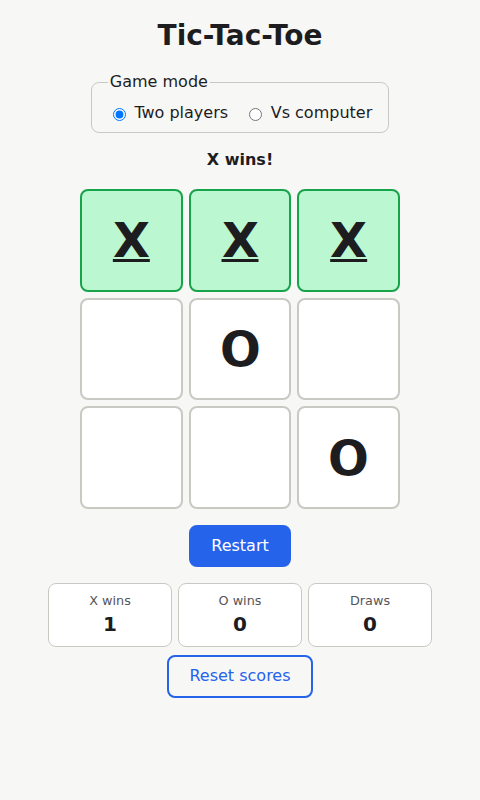
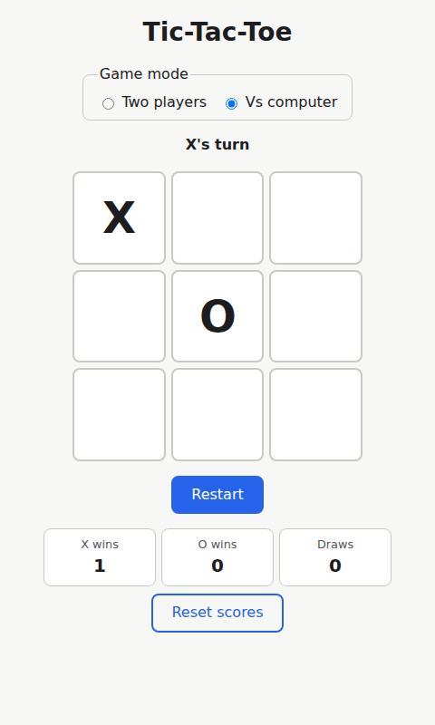

# beebaa — Tic-Tac-Toe

[](https://github.com/mtahamasood/beebaa/actions/workflows/ci.yml)

A tic-tac-toe web app with an **unbeatable minimax AI**. React + Vite + TypeScript, no runtime dependencies beyond React itself.

**▶ Play it: https://mtahamasood.github.io/beebaa/**

| Two-player | Vs computer |
|---|---|
|  |  |

## Features

- **Two modes** — local two-player hot-seat, or vs an unbeatable computer (depth-adjusted minimax; an exhaustive test walks every legal game and proves it never loses)
- **Scoreboard** — X wins / O wins / draws, persisted in `localStorage`, defensive against corrupt or unavailable storage
- **Accessible** — every square is a labeled button, game status announced via `aria-live`, winning line conveyed by more than color, fully keyboard-operable
- **Responsive** — usable from 320px phones up to desktop

## Development

Requires Node 22 (see `.nvmrc`).

```bash
npm install
npm run dev        # dev server at http://localhost:5173
npm test           # vitest suite
npm run typecheck  # tsc -b (checks src/ and vite.config.ts)
npm run build      # production build → dist/
```

The game rules and AI live in [`src/game/logic.ts`](src/game/logic.ts) as pure functions — no React, DOM, or storage imports — so the whole rule set unit-tests without a renderer.

## Contributing

`master` is protected: changes land by PR with the `ci` check green (typecheck + tests + build). Squash or rebase merges only.

Built with [BMad](https://docs.bmad-method.org/) and [Claude Code](https://claude.com/claude-code); planning artifacts live in `_bmad-output/`.
